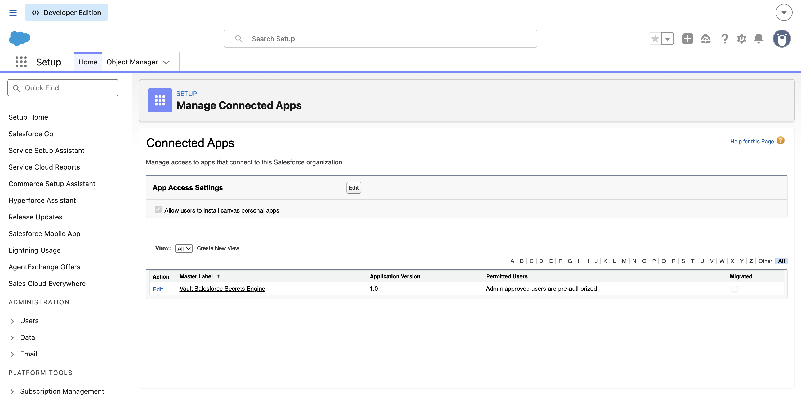
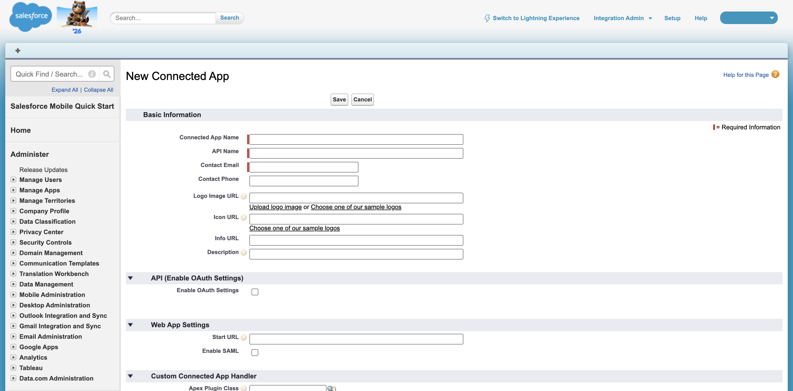
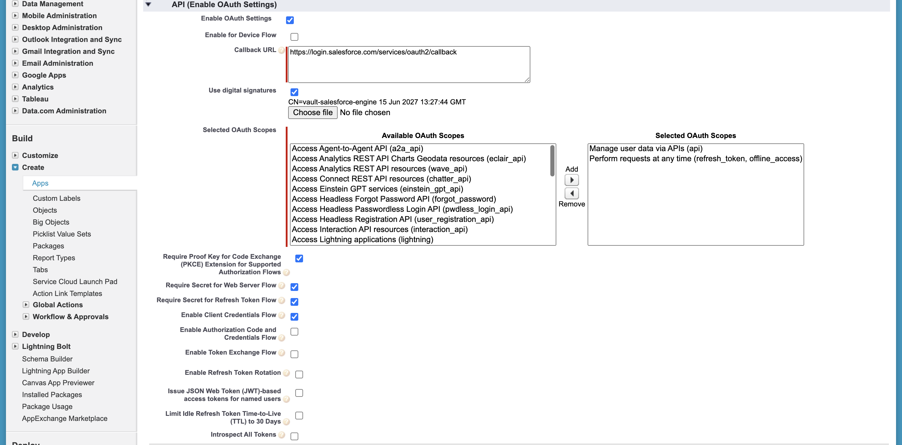
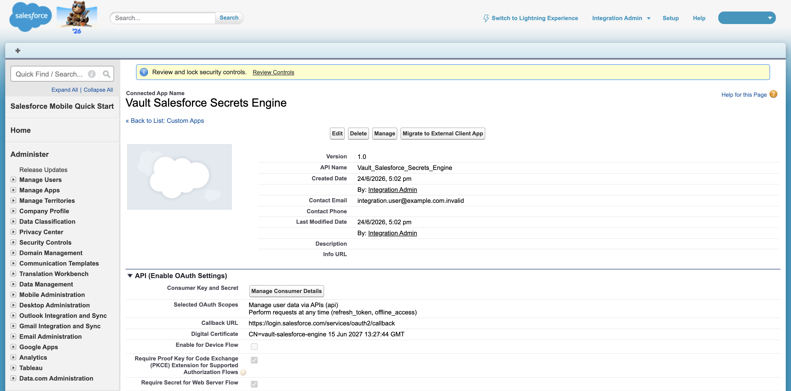
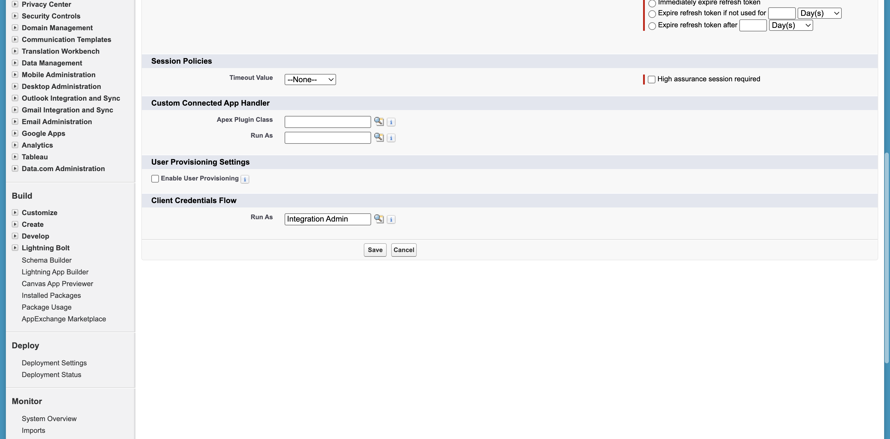
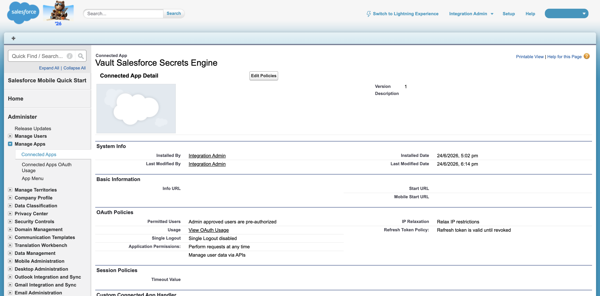
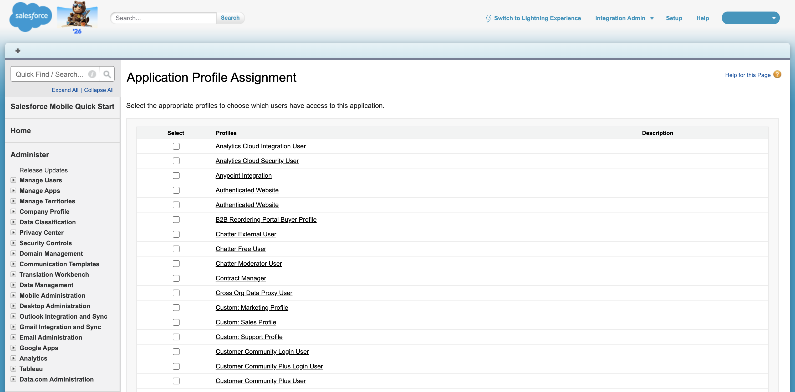

# Salesforce setup guide

This guide configures a Salesforce org so `vault-plugin-secrets-salesforce` can
mint access tokens via the **JWT Bearer** and **Client Credentials** flows.

You only need the flow(s) you intend to use — both can share one Connected App.

> Use a **Developer Edition** org (free) or a sandbox. Both flows require
> **My Domain** (Developer Edition has it on by default).

> This guide was validated end-to-end against a real Developer Edition org. The
> screenshots in `docs/images/connected-app/` are from that run.

---

## 0. Prerequisites

- A Salesforce org where you are a System Administrator.
- **My Domain** enabled: Setup → **My Domain**. Note your domain host, e.g.
  `https://your-domain.my.salesforce.com`. This is your `login_url`.
- `openssl` and (optionally) `curl` + `python3` for the manual verification.

---

## 1. (JWT Bearer only) Create an X.509 signing certificate

Vault holds the **private key**; Salesforce holds the **public certificate**.

```bash
# 2048-bit key + self-signed cert (valid ~1 year)
openssl req -x509 -nodes -newkey rsa:2048 \
  -keyout sf_jwt.key -out sf_jwt.crt \
  -subj "/CN=vault-salesforce-engine" -days 365
```

- `sf_jwt.key` → goes into Vault config `private_key` (keep secret).
- `sf_jwt.crt` → uploaded to the Connected App in step 2.

> Verify the pair matches (the two MD5s must be identical):
> ```bash
> openssl rsa  -in sf_jwt.key -noout -modulus | openssl md5
> openssl x509 -in sf_jwt.crt -noout -modulus | openssl md5
> ```

---

## 2. Create the Connected App

Setup → **App Manager**. Click **New Connected App**.



> ⚠️ **Use "New Connected App", not "New Lightning App" or "New External Client
> App".** External Client Apps are a different object (managed under *External
> Client App Manager*) and don't match this guide. The **App Type** column in App
> Manager tells them apart.

### Basic information

- **Connected App Name**: `Vault Salesforce Secrets Engine`
- **API Name**: auto-fills (e.g. `Vault_Salesforce_Secrets_Engine`)
- **Contact Email**: your email



### Enable OAuth settings

Check **Enable OAuth Settings**, then:

- **Callback URL**: `https://login.salesforce.com/services/oauth2/callback`
  (required by the form even though these flows don't use a redirect).
- **Selected OAuth Scopes**: add **Manage user data via APIs (api)**, and
  **Perform requests at any time (refresh_token, offline_access)**.
- **For JWT Bearer**: check **Use digital signatures** and upload `sf_jwt.crt`.
- **For Client Credentials**: check **Enable Client Credentials Flow**
  (you'll set the run-as user in step 3, after save).



Click **Save**. Salesforce shows a confirmation page (it can take 2–10 minutes to
propagate); click **Continue**.

> ⚠️ **Gotcha — the certificate file input clears if the form reloads.** If the
> page re-renders for any reason (a validation error, navigating back), the
> uploaded cert is silently dropped. After saving, **re-open the app and confirm
> the Digital Certificate shows your `CN=...`** before testing JWT. A wrong/missing
> cert produces `invalid_client: invalid client credentials` at token time.

### Copy the consumer key/secret

On the app's **View/Detail** page, click **Manage Consumer Details**
(this is on the *View* page, not Edit, and requires an emailed verification code):

- **Consumer Key** → Vault config `client_id`
- **Consumer Secret** → Vault config `client_secret` (Client Credentials only)



---

## 3. Connected App policies

App detail → **Manage** → **Edit Policies**.

- **Permitted Users**: `Admin approved users are pre-authorized`
  (required for reliable server-to-server JWT Bearer; see step 4).
- **IP Relaxation**: `Relax IP restrictions` (or allowlist Vault's egress IP).
  Server calls rarely originate from a trusted login IP range.
- **(Client Credentials) Run As**: under the **Client Credentials Flow** heading,
  use the **Run As** lookup (🔍) to pick the integration user the tokens act as.



> ⚠️ **The Run As field is a lookup** — you must pick the user via the magnifying-
> glass popup. Typing the name (or injecting an Id) is rejected with
> `Invalid Data / Invalid User`.

Click **Save**.



---

## 4. Pre-authorize the integration user

Because Permitted Users is *Admin approved*, the JWT `sub` user (and the Client
Credentials run-as user) must be granted the app, or token requests fail with:

- JWT Bearer → `invalid_grant: user hasn't approved this consumer`
- Client Credentials → `invalid_app_access: user is not admin approved to access this app`

Grant it via the user's **Profile** (simplest) or a **Permission Set**.

**Profile (used in this guide):** App detail → **Manage** → scroll to **Profiles**
→ **Manage Profiles** → check the integration user's profile (e.g.
*System Administrator*) → **Save**.



**Permission Set (alternative):** Setup → **Permission Sets** → New
`Vault Salesforce Access` → **Assigned Connected Apps** → add the app →
**Manage Assignments** → assign the integration user.

---

## 5. Values for Vault

| Vault field | Source |
|---|---|
| `login_url` | Your My Domain host, e.g. `https://your-domain.my.salesforce.com` |
| `client_id` | Connected App Consumer Key |
| `client_secret` | Connected App Consumer Secret (Client Credentials) |
| `private_key` | Contents of `sf_jwt.key` (JWT Bearer) |
| `username` (role) | The integration user's username (JWT Bearer `sub`) |

JWT **audience** (`aud`): use `https://login.salesforce.com` (verified working for a
Developer Edition org reached via My Domain). For a sandbox use
`https://test.salesforce.com`.

---

## 6. Quick manual verification (outside Vault)

Confirm the org side before involving Vault.

**Client Credentials:**

```bash
curl -s https://your-domain.my.salesforce.com/services/oauth2/token \
  -d grant_type=client_credentials \
  -d client_id="$CONSUMER_KEY" \
  -d client_secret="$CONSUMER_SECRET" | python3 -m json.tool
```

**JWT Bearer** (RS256 assertion signed with `sf_jwt.key`):

```bash
python3 - <<'PY'
import base64, json, time, subprocess, urllib.parse, urllib.request, os
b64 = lambda b: base64.urlsafe_b64encode(b).rstrip(b'=')
cid, sub, key = os.environ["CONSUMER_KEY"], os.environ["SF_USERNAME"], "sf_jwt.key"
token_url = "https://your-domain.my.salesforce.com/services/oauth2/token"
hdr  = b64(json.dumps({"alg":"RS256"}).encode())
body = b64(json.dumps({"iss":cid,"sub":sub,
                       "aud":"https://login.salesforce.com",
                       "exp":int(time.time())+180}).encode())
si   = hdr + b'.' + body
sig  = b64(subprocess.run(["openssl","dgst","-sha256","-sign",key],
                          input=si, capture_output=True).stdout)
assertion = (si + b'.' + sig).decode()
data = urllib.parse.urlencode({
    "grant_type":"urn:ietf:params:oauth:grant-type:jwt-bearer",
    "assertion":assertion}).encode()
print(urllib.request.urlopen(urllib.request.Request(
    token_url, data=data,
    headers={"Content-Type":"application/x-www-form-urlencoded"})).read().decode())
PY
```

A successful response contains `access_token` and `instance_url`. Confirm the token
works for data with:

```bash
curl -s -G https://your-domain.my.salesforce.com/services/data/v60.0/query \
  --data-urlencode "q=SELECT Name FROM Organization" \
  -H "Authorization: Bearer $ACCESS_TOKEN" | python3 -m json.tool
```

Then proceed to `docs/E2E-RUNBOOK.md` to drive the same flows through Vault.

---

## Troubleshooting

| Symptom | Cause / fix |
|---|---|
| `invalid_client: invalid client credentials` (JWT) | Cert on the app doesn't match `sf_jwt.key` (often the upload was dropped on a form reload). Re-upload `sf_jwt.crt`; verify moduli match. |
| `invalid_grant: user hasn't approved this consumer` (JWT) | Integration user not pre-authorized — assign the profile/permission set (step 4). |
| `invalid_app_access: user is not admin approved...` (Client Credentials) | Same as above — run-as user needs the profile/permission set. |
| `Invalid Data / Invalid User` when saving policies | Run As must be chosen via the lookup popup, not typed. |
| Token request returns nothing for 2–10 min after creating the app | Normal propagation delay; retry. |
